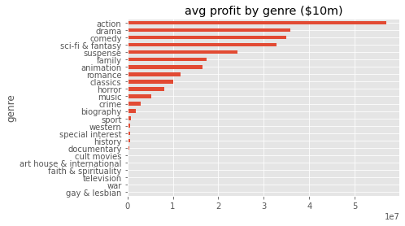
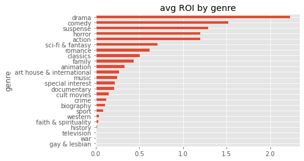
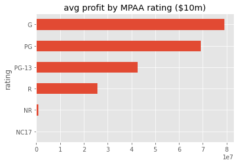
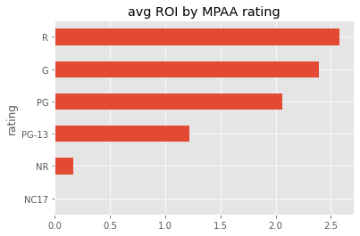
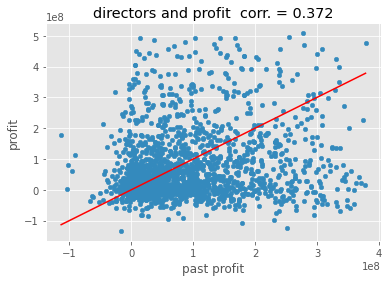
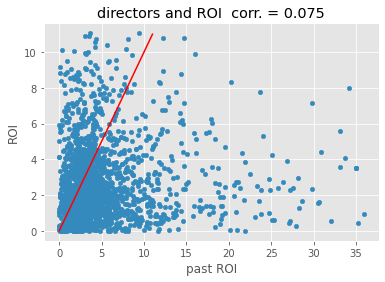
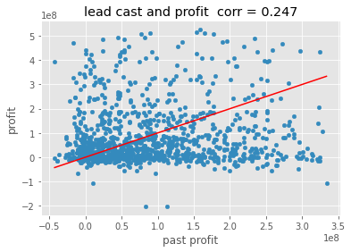
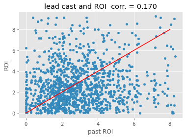

# Aaron Galbraith Flatiron Data Science Phase 1 Project

## Overview

Microsoft is interested in producing movies and seeks our advice about what kinds of movies they should produce. We analyzed available records of movies to determine what factors correlated with high net profits and high returns on investment. We analyzed four areas: (1) runtime, (2) genre, (3) MPAA rating, and (4) profit history of director and lead cast (explained in more detail below). We found higher net profits correlated with longer movies, action movies, G-rated movies, and movies whose director had a strong profit history. We also found that higher ROI correlated with shorter movies, dramas, R-rated movies, and movies whose lead cast had a strong ROI history.

## Business Understanding

The first question to answer is what constitutes a successful movie. In the end, we used both (net) **profit** and **ROI** (return on investment).

Profit and ROI tell different stories. If a project has a high average ROI, then this type of project may be more reliable and thus preferable to a certain type of investor. But if this type of high-ROI project is typically done on a small budget, then it doesn't guarantee a very big profit and may not therefore be worth the effort.

On the other hand, if a type of project has a high average profit, then it is more likely to pay off handsomely, assuming it does pay off.

We considered but dismissed alternate metrics. One was viewership share. It's possible that Microsoft would want to prioritize long-term brand awareness and viewer loyalty (perhaps even subscriptions to a new Microsoft streaming platform) at the potential expense of short-term profits. To explore this, we would need to make deeper comparisons involving how many people are viewing each movie, which would require better data than we have access to, and which might not ultimately be relevant, depending on Microsoft's specific goals.

The second question to answer is *what* we should attribute the success (defined above) of a movie *to*. Within the constraints of the data and with a focus on what elements Microsoft could control, we chose to isolate the variables of runntime, genre, MPAA rating, and the profit and ROI history of both the director and lead actor(s).

## Data Understanding

We originally looked at five families of resources but ultimately only used data from three of them.

Only one resource, The Numbers, included usable data on movie budgets. Because there was no way to measure (net) profit or ROI without budget data, The Numbers data was involved in every analysis we made. This meant that each aspect of our analysis was necessarily limited to the 5,782 records from The Numbers.

IMDb and Rotten Tomatoes provided the balance of the data on runtime, genres, MPAA rating, and cast and crew listings. Although IMDb has a far greater number of records, the records from Rotten Tomatoes overlapped better with the records from The Numbers in most respects.

The data from the original Rotten Tomatoes files was unusable since none of its records included any titles. We replaced these with other Rotten Tomatoes records sourced from Kaggle, which were very rich indeed and actually provided more usable records than IMDb, given that the records needed to overlap with those from The Numbers in order to be usable. The Rotten Tomatoes records included data on running time, genre, MPAA rating, and directors.

The other two resource families proved unusable because their data was redundant and less extensive than others. Box Office Mojo had incomplete data on box office grosses but no data on budgets. The Movie Data Base would have only added information on "popularity", which, upon further investigation, seems to have been defined in a very loose way that we cannot concretely relate to profit or ROI.

## Data Analysis

### Runtime

We analyzed runtime by (1) removing outliers (anything more than 2 standard deviations, for both runtime and profit), (2) cutting the data into equally-sized percentile bins for runtime, and (3) plotting those bins against profit and ROI.

The results show that profit generally increases with runtime, and ROI generally decreases with runtime.

What this means for Microsoft depends on their goals and how risk averse they are. If they want to go for big profits, the results suggest they should make longer movies. If they prefer reliable returns, they should make shorter movies (perhaps more of them).

### Genre

In order to analyze the effect of genre, it was necessary to isolate single genres, as IMDb and Rotten Tomatoes both listed multiple genres for the majority of their records. After teasing the genres apart, we discovered that action movies achieved higher profits while dramas achieved higher ROI.

### MPAA Rating

This analysis worked much like the genre analysis did, in that we found the average net profit and ROI associated with each MPAA rating. In this case, however, our data on MPAA rating came only from Rotten Tomatoes.

We found that G-rated movies typically made the most profit, while R-rated movies were associated with the highest average ROI.

## Profit History

This analysis was the most complicated to carry out (and to explain). We can use the profit history for Jurassic Park to illustrate:

Jurassic Park was released in 1993 and directed by Steven Spielberg. To calculate the "past profit" for Jurassic Park, we would look at all the movies its director (Spielberg) directed *before* its year of release, 1993. (This list would include, for example, Jaws (1975) but not Minority Report (2002)). The average profit (adjusted for inflation) of these pre-1993, Spielberg-directed movies is the "past profit" of Jurassic Park.

We also performed this calculation for ROI instead of net profit, again considering the history of a movie's director.

Then we performed the calculations for both net profit and ROI for the "lead cast" instead of the director. In this lead cast analysis, we looked at the top two "principals" of a movie. The principals of a movie are not always both cast members — sometimes the director or a producer is listed as one of the top principals. We controlled for this by limiting the "lead cast" analysis to just cast members who appeared in either of the top two "principals" spots.

Note: the red lines in these plots are NOT regression lines. They are merely there to show where past and current values would be *equal* — anything *above* a red line represents a movie that *outperformed* its director's (or lead cast's) profit history, and anything below is a movie that underperformed.

The strongest correlation of the four analyses here was that between director profit history and the profit of a movie. This suggests that hiring the right director can be a possible factor in generating high profits. A director's ROI history, on the other hand, had very little correlation to the ROI of a given movie.

The correlations associated with lead casts were both relatively weak, but positive.

## Conclusion

### Recommendations for maximizing profit

1. 115+ minutes
2. genre: action / adventure
3. G rating
4. assign a director with a strong record of past profits

### Recommendations for maximizing ROI

1. at most 90 minutes
2. genre: drama
3. R rating
4. cast lead actors with strong records of past ROI